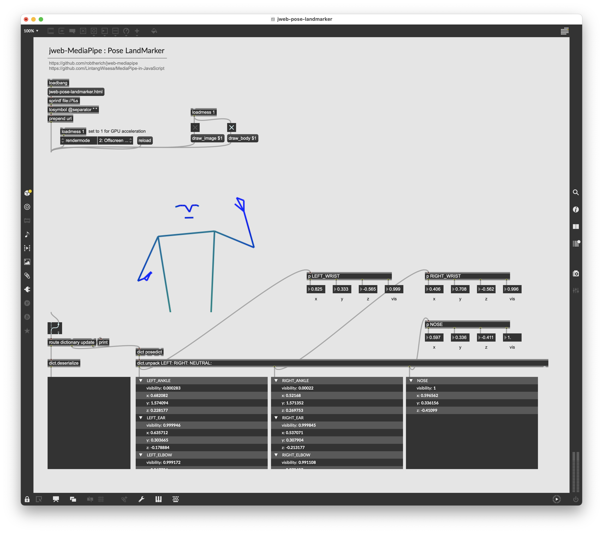

# jweb-pose-landmarker

A self contained example demonstrating how to use Mediapipe Pose Landmarker with Max's `jweb`



## Pose landmarker model

The pose landmarker model tracks 33 body landmark locations, representing the approximate location of the following body parts:


```
0 - nose
1 - left eye (inner)
2 - left eye
3 - left eye (outer)
4 - right eye (inner)
5 - right eye
6 - right eye (outer)
7 - left ear
8 - right ear
9 - mouth (left)
10 - mouth (right)
11 - left shoulder
12 - right shoulder
13 - left elbow
14 - right elbow
15 - left wrist
16 - right wrist
17 - left pinky
18 - right pinky
19 - left index
20 - right index
21 - left thumb
22 - right thumb
23 - left hip
24 - right hip
25 - left knee
26 - right knee
27 - left ankle
28 - right ankle
29 - left heel
30 - right heel
31 - left foot index
32 - right foot index
```

## Resources

This example is inspired by [an example by Rob Ramirez](https://github.com/robtherich/jweb-mediapipe), which is in turn inspired by [MediaPipe in JavaScript](https://github.com/LintangWisesa/MediaPipe-in-JavaScript).
